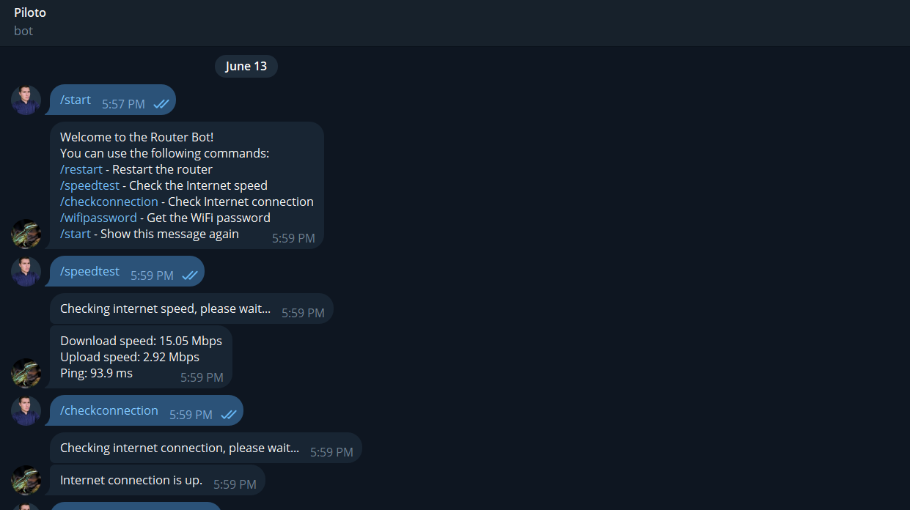
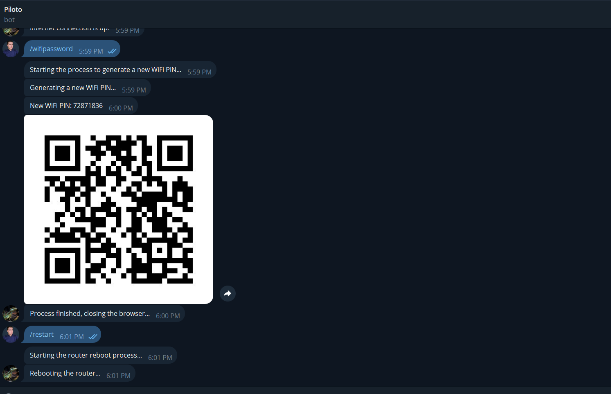

# Arris Router Telegram Bot
This project automates the reboot process for Arris or Motorola routers using Selenium and Python. It handles timeout errors that might occur during the reboot process.

## 1. Introduction:
This project automates the process of rebooting Arris or Motorola routers using Selenium. It's designed to handle timeout errors during the reboot process to ensure a smooth and reliable operation..

### Prerequisites
- Python > 3.10 
- Selenium
- WebDriver for the browser you are using (e.g., - ChromeDriver for Google Chrome)

## Installation
### 1. Clone the Repository:
        git clone https://github.com/netto14cr/Arris_Router_Telegram_Bot.git

#### *.env*
        TELEGRAM_TOKEN=your_telegram_bot_token        
        ROUTER_URL=http://your_router_url     /ex:(http://192.168.0.1)
        ROUTER_USERNAME=your_router_username /ex:(admin)
        ROUTER_PASSWORD=your_router_password /ex:(motorola)

### Install Dependencies
#### *sh*
        python -m venv env
        source env/bin/activate  # For Linux/Mac
        .\env\Scripts\activate  # For Windows
        pip install -r requirements.txt

### Activate Virtual Environment
- For Linux/Mac:
        source env/bin/activate

- For Windows:
        .\env\Scripts\activate

### Running the Bot
        python arris_router_telegram_bot.py

## Screenshots

##  License
***Note: This project is licensed under the MIT License.*

## Contact
For any queries or support, please open an issue on the GitHub repository.
