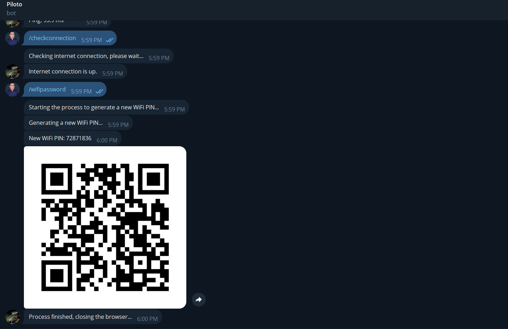

# Telegram Question-Answering Bot

The **IA_TELEGRAM_BOT_01** project is a question-answering bot developed using the Transformers library and Telegram. The bot is designed to answer questions based on context provided by the user. It uses the *roBERTa-base* language model, which has been fine-tuned using the *SQuAD2.0* dataset for extractive question answering.

## 1. Bot Operation:

### a. Initialization and Setup:

- The bot is initialized by sending the /start command in Telegram.
- The Telegram API token must be configured in a .env file.

### b, Interacting with the Bot:

- Users can send questions to the bot.
- The bot requests the context in which to answer the question.
- Once the context is provided, the bot responds with the answer to the question.

### c. Example of functions:

- The user starts the bot with /start.
- The user sends a question, for example, "What is my name?".
- The bot requests the context, and the user responds, "My name is  Clara and I live in Berkeley".
- The bot responds with the answer to the original question.

## 2. Setup

### a. Clone the Repository:

    git clone https://github.com/netto14cr/IA_TELEGRAM_BOT_01.git
cd your_repository

### b. Create .env File:

- Create a .env file in the project root directory.
- Add your Telegram API token to the .env file.

        TELEGRAM_TOKEN=your_telegram_token_here

### c. Run install.bat Script:
- Double-click on install.bat to create the virtual environment and install the required libraries.

### 4. Activate Virtual Environment:

- For Linux/Mac:

        source env/bin/activate
    
- For Windows:

        .\env\Scripts\activate

### 5. Running the Bot:
        python ia_bot.py

## 3. Example Usage

- User: /start

        Bot: "Hello! I am a question-answering bot. Please ask me a question."

- User: "Where do I live?"

        Bot: "Please provide the context."

- User: "My name is Wolfgang and I live in Berlin"

        Bot: "Berlin"

- User: "Do you want to ask another question?"

    User: *Select yes button*

        Bot: "Please ask a question."
- User: "What's my name?"

        Bot: "Please provide the context."
- User: "My name is Sarah and I live in London"

        Bot: "Sarah"
- User: "Do you want to ask another question?"

        Bot: "Goodbye!"

## 4. More information:

- Visit the web page of *roberta-base-squad2*
    
        https://huggingface.co/deepset/roberta-base-squad2

**Note:** *This bot is for educational purposes and may not provide accurate answers for all questions.*

## 5. Screenshots

